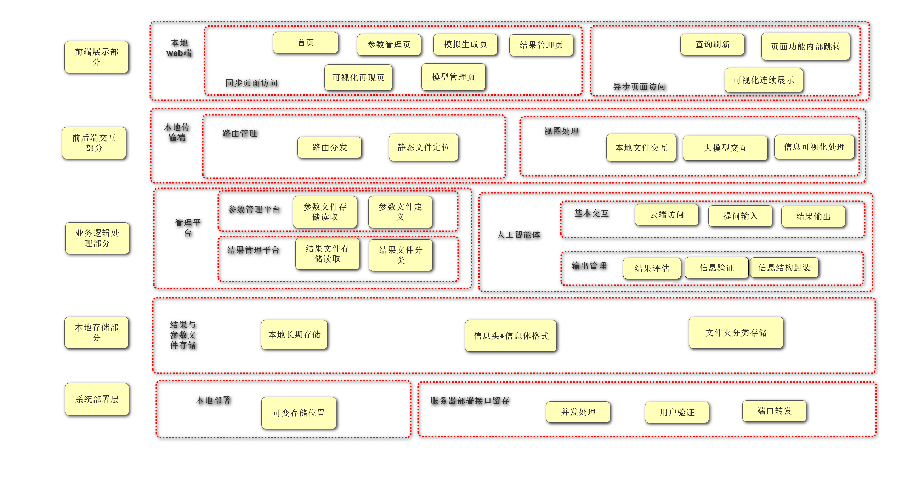

# 基于生成式ai的交通模拟辅助决策系统架构设计

1. 目标设计
    * 完成可以基于生成式ai，并通过初始参数的输入，得到完整模拟结果，以辅助决策的应用
2. 需求分析
   * 角色与相关需求
     * 初始参数管理员
       1. 可以通过系统，简单的创建参数数据模型，包含数据模型中各基本参数的定义与解释以及数据模型的结构
       2. 可以通过系统，简单的管理不同版本（不同初始参数，不同数据模型结构）的参数数据模型，包含增删改查，以及对参数模型的归类
     * 模拟运行操作员
       1. 可以通过系统，简单的获取不同类的参数模型集
       2. 可以通过系统，简单的依照要求放入参数模型集，并启动模拟运行
       3. 可以通过系统，简单的了解运行状况，运行进度，与报错日志
     * 数据结果管理员
       1. 可以通过系统，简单的获取数据模型结果集
       2. 可以通过系统，查看可视化的运行结果
       3. 可以通过系统，简单的对数据模型结果集进行进一步分类
       4. 可以通过系统，简单的获取经过分类的数据模型结果中或者之间的各种比对信息
     * 大模型管理员（功能选做：如果大模型作答内容质量低，则变为必做）
       1. 可以通过系统，对模型进行调优，包含（RAG与大模型微调）
       2. 可以通过系统，切换使用大模型（选做：如果项目其他内容完成，可以考虑完成）
3. 实现方案设计
   1. 方案一
      * 具体内容：每一个时间片上，每一辆车分别计算最优路经，得到整体的交通网图
      * 优势：可以溯源每一辆车的行为路径，得到的交通网图相对更加真实有效
      * 劣势：车辆的移动计算十分麻烦，各种参数的传入比较苦难
      * 不选择的原因：存储结构难以抉择，数据量提升后效率明显降低
      * 未来扩展的可能性：在方案二完成后，可以考虑作为扩展功能
   2. 方案二
      * 具体内容：每一个时间片上，整体的道路情况交代，通过时空扩散模型得到未来情况
      * 优势：可以轻易的通过较为简单的参数获得未来一定时间段的车流总体情况，可以体现特殊事件的影响
      * 劣势：由于时空扩散模型具有随机性，以及大模型幻觉，获得的结果可能不够准确
      * 选择的原因：实现难度相对更低，其次不够准确的问题，可以通过增加评估模块用奖励惩罚机制获得更好的结果
4. 系统架构
   1. 系统框架图
        
   2. 各子系统简介
      1. 前端展示部分：辅助用户可视化的使用系统相关功能，呈现系统操作界面与结果展示界面
      2. 前端后端交互部分：桥接前端后端的内容交互与传输，成为显示与业务逻辑的纽带
      3. 业务逻辑处理部分：实现核心业务代码，完成数据的处理与返回
      4. 本地存储部分：存储运行结果，运行参数以及运行的初始参数，将内容长期存储与本地
      5. 系统部署层：实现源代码的落地，使用
   3. 给功能模块介绍
      1. 同步页面访问：完成同步页面的切换，实现大功能的页面访问
      2. 异步页面访问：完成异步页面的刷新，实现局部功能的访问
      3. 路由管理：处理url，分派任务
      4. 视图处理：请求需要的数据，并返回可视化的信息
      5. 管理平台：管理初始参数文件，管理结果文件以及分析文件，实现CRUD以及分类
      6. 人工智能体：实现云端访问，完成数据的分析，与输出验证
      7. 结果与参数文件存储：实现本地长期存储与格式要求和分类存储
      8. 本地部署：实现简单的单机实地运行
      9. 服务器部署接口留存：预留未来服务器部署扩展接口，方便项目的线上运行
5. 子功能模块设计
   1. 各功能模块子模块设计
      * 本地参数文件管理模块
        * 作用：管理本地参数文件
        * 功能描述
          * 管理系统初始化参数
          * 管理交通网图车辆初始信息
        * 内容设计
          * 需要实现的api
            * ParamDocManager
              * doc_name_generator: 生成参数集文件夹，并进行命名
                * 文件夹命名规范：{用户给出的名字}_param_doc
                * 文件夹命名要求：都为英文小写字母，不得重复
              * load_title_structure_doc: 加载参数集头文件模板 -> json
                * 参数集头文件格式1
                  * 键：road_info
                  * 值：道路信息 -> json串 
                    * 键：road_name{num}
                    * 值： 路名 -> str
                  * 键：param_num
                  * 值：参数文件数量 -> int
              * load_json_doc: 读取参数集头文件的初始参数文件数量，并加载初始参数模板 -> json  [start_time, car_stream_amount, [[name, range, level, re], [], ...], [[content, location, time], [], ...]]
                * 参数文件格式
                  * 键：start_time
                  * 值：起始时间 -> 时间格式
                  * 键：car_stream_amount
                  * 值：车流量数值 -> int
                  * 键：special{num}
                  * 值：特殊事件信息 -> json串
                    * 键：name
                    * 值：特殊事件名称 -> str
                    * 键：range
                    * 值：影响时间范围 -> str 
                    * 键：level
                    * 值：影响强度 -> int
                    * 键：re
                    * 值：影响结果 -> str
                  * 键：decision{num}
                  * 值：决策信息 -> json串
                    * 键：content
                    * 值：决策内容
                    * 键：location
                    * 值：决策地点
                    * 键：time
                    * 值：决策时间区间
              * doc_json_generator: 生成参数集头文件/生成初始参数文件 -> json file
                * 生成结果格式
                  * 文件名：origin_param_title/origin_param{doc_param_num}
              * doc_del: 删除指定的参数集文件夹
              * doc_index: 查找到对应的参数集文件夹
              * file_del: 删除指定的初始参数文件
              * file_index: 查找指定的初始参数文件
          * 抽象层 
            * BaseCar类：各类车辆的父类 
      * 结果数据文件管理模块
         * 作用：管理本地结果文件
         * 功能描述
           * 管理结果文件以及结果分析文件
           * 结果文件分类
         * 内容设计
           * 需要实现的api
             * ReDocManager
               * 方法
                 * doc_name_generator: 生成主结果文件夹，并进行命名/生成副结果文件夹，并进行命名
                   * 文件夹命名规范：{参数集文件夹中用户给出的名字}_re_doc/re_doc{doc_re_num}  
                   * 文件夹命名要求：都为英文小写字母，不得重复
                 * load_title_structure_doc: 加载结果数据头文件模板 -> json
                   * 结果数据头文件主文件夹模板
                     * 键：re_num
                     * 值：结果副文件夹数量 -> int
                     * 键：param_set
                     * 值：对应的参数集文件夹名 -> str
                     * 键：tag_{用户给出的标签名}
                     * 值：此标签下的文件名 -> list
                   * 结果数据头文件副文件夹模板
                     * 键：param_set
                     * 值：使用的参数文件名 -> str
                 * load_json_doc: 读取结果数据头文件的结果文件数量，并加载结果文件模板 -> json 
                   * 结果文件格式1（决策前）
                   * 结果文件格式2（决策后）
                   * 结果文件格式3（决策建议）
                 * doc_json_generator: 生成决策前/决策后/决策文件 -> json file
                   * 生成结果格式
                     * 文件名：re_title/re_analysis{analyse_doc_num}/re_thermodynamic_diagram{thermodynamic_diagram_doc_num}
                 * doc_del: 删除指定的结果文件夹
                 * doc_index: 查找到对应的结果文件夹
                 * file_del: 删除指定的结果文件
                 * file_index: 查找指定的结果文件
                 * add_tag: 增加标签
                 * del_tag: 删除标签
                 * add_file: 在指定标签中增加副文件夹名
                 * rm_file: 在指定标签中删除副文件夹名
                 * update_file: 更新文件内容信息
      * 结果数据可视化模块
        * 作用：可视化结果再现
        * 功能描述
          * 加载需可视化的基本数据
          * 连结时空关系图
        * 内容设计
          * 需要实现的api
            * load_single_thermodynamic_diagram: 加载热力图数据
            * zip_diagrams: 连结热力图，展现时空变化
          * 抽象层
            * Metric类：所有矩阵的父类
      * 大模型切换模块
        * 作用：大模型基本参数管理
        * 功能描述
          * 使用的大模型切换
          * 大模型对象生成
          * 管理外部api密钥
          * 大模型的token最大数限制
        * 内容设计
          * 需要实现的api
            * generator_llm_obj: 生成若干大模型对象
            * switch_llm_obj: 切换使用的大模型对象
          * 抽象层 
            * LLM: 各种大模型父类
      * 大模型RAG模块（选做，暂不完成）
        * 作用：
        * 功能描述
        * 内容设计
          * 需要实现的api
          * 抽象层  
      * 大模型微调模块（选做，暂不完成）
        * 作用：
        * 功能描述
        * 内容设计
          * 需要实现的api
          * 抽象层
      * prompt生成模块
        * 作用：大模型提示词模板管理
        * 功能描述
          * 模板信息管理
          * 动态模板生成
        * 内容设计
          * 需要实现的api
            * load_pre_template: 加载基本背景模板
            * load_road_info_template: 加载路网信息模板
            * load_car_stream_info_template: 加载车流量信息模板
            * load_occasion_template: 加载特殊场景信息模板
            * load_decision_template: 加载决策模板
            * load_re_template: 加载输出内容要求模板
            * load_output_format_template: 加载输出格式模板
            * load_examples_template: 加载输出示例模板
            * load_forbidden_template: 加载禁止事情模板
            * zip_template: 组合模板
          * 抽象层  
            * langchain模板相关抽象层
      * llm交互模块
        * 作用：大模型交互
        * 功能描述
          * 获取大模型反馈
          * 动态更新结果信息文件
        * 内容设计
          * 需要实现的api
            * get_final_template: 获取最终的模板
            * chat_with_llm: 与大模型交互
            * get_final_re: 获取最终大模型结果
            * generator_final_re_doc: 生成最终结果文件夹及其相关文件
            * update_re_doc: 更新文件夹内的相关文件
            * get_re_doc: 获取指定文件夹的相关内容
            * add_analyse_file: 增加分析文件
            * simulation_global: 反复模拟所有时间的交通状况直到完成 -> 处理ValueError异常
          * 抽象层  
            * langchain模板相关抽象层
      * 结果信息处理模块
        * 作用：结果标准化管理
        * 功能描述
          * 更新车辆路径
          * 更新整体信息
          * 更新分析信息
          * 内容评估系统
        * 内容设计
          * 需要实现的api
            * update_thermodynamic_diagram_info: 更新热力图信息
            * update_analyse_info: 更新分析信息
            * estimate_re: 评估大模型内容
            * regenerate_info: 重新调用大模型生成结果 -> 抛出ValueError异常
          * 抽象层 
            * langchain模板相关抽象层
            * json相关抽象层
      * 初始参数管理ui模块
        * 作用：便捷地可视化管理初始参数文件
        * 功能描述
          * 可视化参数操作信息访问
        * 内容设计
          * 需要实现的api
            * index_view: 显示主页
            * seek_dir_view: 显示参数集查询页面
            * seek_doc_view: 显示参数文件查询页面
            * detail_view: 展示具体参数头文件信息以及初始参数文件信息页面
            * add_dir_view: 显示增加新的参数集页面
            * add_doc_view: 显示增加新的初始参数文件页面
            * rm_dir_view: 删除参数集文件夹
            * rm_doc_view: 删除初始参数文件
          * 抽象层
            * django相关抽象层
      * 结果数据管理ui模块
        * 作用：便捷地可视化管理结果数据文件
        * 功能描述
          * 可视化数据结果操作信息访问
        * 内容设计
          * 需要实现的api
            * index_view: 显示主页
            * seek_main_dir_view: 显示主结果数据文件夹查询页面
            * seek_sub_dir_view: 显示副数据文件夹查询页面
            * seek_doc_view: 显示结果文件查询页面
            * detail_view: 展示具体结果数据头文件以及结果文件信息
            * rm_dir_view: 删除结果数据文件夹
            * rm_doc: 删除结果文件
            * add_tag_view: 显示增加标签页面 
            * rm_tag: 删除标签
            * add_file_view: 显示增加指定标签中的文件页面
            * rm_file: 删除指定标签中的文件
          * 抽象层 
            * django相关抽象层
      * 结果数据可视化模块
        * 作用：可视化模拟运行结果，直观的了解交通状况
        * 功能描述
          * 可视化结果信息再现
        * 内容设计
          * 需要实现的api
            * index_show: 显示主页
            * get_dir_view: 显示选择指定主结果文件夹中的副结果文件夹页面 
            * simulation_func_view: 显示选择模拟生成车辆追踪页面
            * simulation_view: 显示模拟生成可视化结果页面
            * simulation_next_view: 显示下一个交通热力图画面
            * simulation_previous_view: 显示上一个交通热力图画面
            * simulation_in_a_row_view: 连续的交通热力图画面
            * simulation_pop_view: 跳转至某一个交通热力图画面
          * 抽象层  
            * django相关抽象层
      * 模拟生成信息可视化模块
        * 作用：直观的进行模拟生成，并了解模拟生成状态
        * 功能描述
          * 可视化模拟生成过程
        * 内容设计
          * 需要实现的api
            * index_view: 显示主页
            * get_simulation_dir_view: 显示选择模拟生成初始参数集文件夹页面
            * simulation_status_view: 显示模拟生成进度状态
          * 抽象层  
            * django相关抽象层
      * 大模型管理ui模块
        * 作用：直观的进行大模型使用切换，并进行大模型微调与rag（暂不做）
        * 功能描述
          * 可视化管理使用大模型
        * 内容设计
          * 需要实现的api
            * index_view: 显示主页
            * switch_view: 显示切换页面
            * seek_view: 显示可切换模型查询
            * add_view: 显示增加模型页面
            * del_view: 删除模型
            * rag_view: rag页面
            * fine_tuning_of_llm: 大模型微调
          * 抽象层  
            * django相关抽象层
      * 通用数据模型模块
        * 作用：实现数据模型
        * 功能描述
          * 实现车辆信息的判断
          * 实现网图的信息变化
          * 实现矩阵的基本功能
        * 内容设计
          * 需要实现的api    
            * Metrics
              * 属性
                * metric: 可以化为方阵
              * 方法
                * get_ele: 获取矩阵中的某一个值
                * set_ele: 设置矩阵中的某一个值
                * origin_set_metric: 初始化矩阵的值
                * switch_metric_ele: 交换矩阵中的值
            * LLM
              * 属性
                * api_base
                * api_key
                * model_name
                * total_token_cost
                * cost_per_token
              * 方法
                * generator_llm_obj: 返回大模型对象
                * cal_cost: 计算token花费
          * 抽象层
            * Metrics: 所有矩阵的父类
            * LLM: 所有大模型父类
      * 通用方法模块   
        * 作用：完成部分通用方法
        * 功能描述
          * 实现文件的底层操作
          * 实现基本验证类的底层操作
        * 内容设计
          * 需要实现的api
            * create_dir:   
            * create_file: 创建文件
            * update_file: 更新文件
            * rm_dir: 删除文件夹
            * rm_file: 删除文件
            * open_file_r: r模式打开文件
            * open_file_a: a模式打开文件
            * open_file_w_create: w模式打开文件
            * open_file_w_update: w模式打开并更新文件内容
            * turn_to_python_type: 反序列化json串
            * Validator
              * 属性
                * validate_elem: 需要验证的一个属性
              * 方法
                * single_elem_validate: 单一元素验证
            * ValidatorSet
              * 属性
                * elem_list: Validator集合 -> list
              * 方法
                * validate_one_by_one: 依次进行单一验证
                * validate_all: 整体验证
          * 抽象层
            * Validator: 所有单一验证的父类
            * ValidatorSet: 所有集合验证的父类
   2. 整体功能调用图
        
6. 技术架构设计
   1. 技术栈罗列
      * python语言：实现所有基础循环和类与方法构建
      * django框架：实现前后端的桥接，并实现网页模板
      * uWsgi：实现高效的并发处理
      * ajax异步：实现舒适的网页刷新，提供更好地可视化效果
      * langchain框架：实现便捷的提示词模板生成，大模型交互与大模型结果地验证与序列化
      * html，css，js技术
      * 云服务器调用：实现强大地模型计算能力
      * os库：实现与系统的交互
      * json库：实现json格式文件的解析与生成
      * git：实现版本管理与多人合作
   2. 技术栈交互
      * 前端的ajax获取用户的需求，通过uWsgi与Django框架来和后端沟通
      * django的视图通过python语言后端，使用os库完成本地文件交互
      * django的视图通过python语言后端，使用json库完成所需数据的解析
      * django的视图通过python语言后端，获取大模型计算的结果
      * python语言后端与langchain框架，生成提示词模版，间接的与大模型交互，并验证序列化大模型结果
      * langchain框架通过与云服务器交互，直接地与大模型交流
   3. 技术点列举和解决
      1. 通用技术点
         * 列表增删改查  
           * 代码示例：
             ```python
             
             list_a = []
             list_a.append('元素a')
             print(list_a[0])
             list_a[0] = 1
             del list[0]
             
             ```
         * 前后端交互 | django框架
           * 代码示例：
             ```python
             
             # url /home 
             
             # urls.py
             urlpatterns = [
                path('home', views.show)
             ]
             
             # views.py
             
             def show()
                pass
             
             ```
         * 文件的CRUD | os库的使用
           * 代码示例：
             ```python
             
             # 以某种模式打开文件
             with open('file', 'mode') as f:
                pass
             
             ```
         * 传输结构的封装与解析 | json库的使用
           * 代码示例：
             ```python
             
             # 转json
             json.dumps(要转的内容, sort_keys=True, separators=(':', ','))
             # json转非文件
             json.loads(要转的内容)
             # json转文件中
             with open('file') as f:
                data = json.load(f)
             
             ```
         * 字典操作
           * 代码示例：
             ```python

             my_dict = {}
             my_dict[a] = 1
             my_dict[a] = 'nihao'
             print(my_dict[a])
             del my_dict[a]             
             
             ```
         * 矩阵数据结构实现 | 嵌套列表，类的封装
           * 代码示例：
             ```python
             
             class Metrics:
                def __init__(self):
                    self.metric = []
             
                def origin_set_metric(self, list_rows)
                    Metrics.__validate(list_rows)
                    for item in list_rows:
                        self.metric.append(item)   
                
                @staticmethod
                def __validate(list_rows):
                    column_len = len(list_rows)
                    for item in list_rows:
                        if column_len != len(item):
                            raise ValueError
                
                pass
             
             ```
         * 前端内容验证技术 | 类的封装与方法调用
           * 代码示例：
             ```python
             
             # 单个验证
             class MyValidator(Validator):
                def __init__(self, para):
                    self.single_elem_validate = para
             
                def single_elem_validate(self, para):
                    pass

             
             # 验证集合
             class MyValidatorSet(ValidatorSet):
                def __init__(self, *args)
                    self.__elem_list = args
             
                def validate_one_by_one(self):
                    for item in self.__elem_list:
                        item.single_elem_validate()
             
                def validate_all(self):
                    pass
             
             ```
         * 多人代码上传 | git
           * 代码示例：
             ```bash
             
             # 初始化
             git init
             # 连接远程仓库
             git add remote loc https://github.com/Cx330yxh/yxh.git
             # 上传
             git push
             # 下载
             git pull
             
             ```
      2. 关键技术点
         * 大模型提示词动态生成技术 | langchain的template相关模块
           * 代码示例：
             ```python
             
             prompt = load_prompt('filename.json')
             prompt.format(param='')
             
             ```
         * 大模型交互技术 | 云服务器的key与base调用
           * 代码示例：
             ```python
             
             llm.invoke(prompt)
             
             ```
         * 大模型结果检验技术与序列化技术 | langchain的pydantic相关模块
           * 代码示例：
             ```python
             
             class MyValidate(BaseModel):
                paramA:str = Field(description='xxx')
             
                @validator('paramA')
                def func(cls, field):
                    pass
             
             
             parser = PydanticOutputParser(pydantic_object=MyValidate)
             prompt = PromptTemplate(template='{paramB}\n{paramC}', 
                                     input_variables=['paramC'], 
                                     partial_variables= {'paramB': parser.get_format_instruction()})
             out_put = llm.invoke(prompt)  
             parser.invoke(out_put)
             
             ```
         * 大模型切换技术 | 大模型全局对象的更改与langchain对各种大模型的支持
           * 代码示例：
             ```python
             
             llm = oldLLM()
             
             
             def switch_llm_obj(new_llm_obj):
                global
                llm = new_llm_obj 
             
             ```
         * 网页可视化结果生成技术 | json格式内容的解析与html，css，js技术
           * 代码示例：
             ```html
             
             <head>
                <style>
                    div{
                        background-color: red;
                    }  
                </style>
             </head> 
             <body>
                 <div></div>
                 <script>
                    const btn = document.querySelector('div')
                 </script>
             </body>

             ```
         * 异步刷新网页内容 | ajax技术
           * 代码示例：
             ```html
             
             <script>
                // get 的ajax
                if (windows.XMLHttpRequest){
                    // 支持XMLHttpRequest
                    let xhr = new XMLHttpRequest();
                }else{
                    // 不支持XMLHttpRequest，使用ActiceXObject创建异步对象
                    let xhr = new ActiceXObject("Microsoft.XMLHTPP")
                }
                xhr.open('get', url, true);
                // 设置回调函数
                xhr.onreadystatechange = function(){
                    if(xhr.readyState == 4 && xhr.status == 200){
                         xhr.responseText;
                    }
                }
                // 放送请求
                xhr.send(null);
             </script>
             
             ```
   4. 技术架构图
      
7. 业务流程设计
   1. 本地参数管理  /param_control
      * 前端
        * 主页提供跳转子功能页面的入口 
          * 涉及路由
            * /param_control/index
        * 查询主界面，提供基本的参数集文件夹的查看界面跳转，查询，删除以及增加界面跳转功能 
          * 涉及路由
            * /param_control/query_main?param_dir=xxx 
            * /param_control/del?del_dir=xxx 
            * /param_control/add_dir
        * 查询详细界面，提供本地参数集中参数文件的查看界面跳转，查询，删除以及增加界面跳转功能
          * 涉及路由
            * /param_control/query_detail?param_dir=xxx&file_name=xxx
            * /param_control/del?del_file=xxx
            * /param_control/details?file_name=xxx
            * /param_control/add_file
        * 增加界面，提供基本的参数输入，以供创建要求的增加内容
          * 涉及路由
            * /param_control/add_dir
            * /param_control/add_file
        * 查看界面，直接在页面中渲染本地文件
          * 涉及路由
            * /param_control/detail?file_name=xxx  
      * 后端
        * 实现一个子模块下不同路由跳转不同功能页面
        * 联动本地参数管理模块，实现相关的CRUD
   2. 结果管理 /re_control
      * 前端
        * 主页提供跳转子功能页面的入口
          * 涉及路由
            * /re_control/index
        * 查询主界面，提供基本的结果主文件夹的查看界面跳转，查询，删除功能
          * 涉及路由
            * /re_control/query_main?re_main_dir=xxx 
            * /re_control/del?del_dir=xxx 
        * 查询副界面，提供基本的结果副文件夹的查看界面跳转，查询，删除功能
          * 涉及路由
            * /re_control/query_sub?re_sub_dir=xxx 
            * /re_control/del?del_dir=xxx 
        * 查询详细界面，提供结果副文件夹中结果文件的查看界面跳转，查询，删除，分类界面跳转功能
          * 涉及路由
            * /re_control/query_detail?re_main_dir=xxx&re_sub_dir=xxx&   file_name=xxx
            * /re_control/del?del_file=xxx
            * /re_control/details?file_name=xxx
        * 查看界面，直接在页面中渲染本地文件
          * 涉及路由
            * /re_control/details?file_name=xxx
        * 分类页面，允许输入参数，来增加新的标签和crud标签下的文件集
          * 涉及路由
            * /re_control/tag_add?tag=xxx
            * /re_control/tag_rm?tag=xxx
            * /re_control/tag_file_add?tag=xxx&file=xxx
            * /re_control/tag_file_rm?tag=xxx&file=xxx
      * 后端
        * 实现一个子模块下不同路由跳转不同功能页面
        * 联动本地结果文件管理模块，实现相关的CRUD，以及相关标签的添加删除，即其文件的增加和删除
   3. 大模型管理/model_control
      * 前端
        * 主页提供跳转子功能页面的入口
          * 涉及路由
            * /model_control/index
        * 查询界面，查看支持的大模型api
          * 涉及路由
            * /model_control/query
        * 切换界面，更换其他可用的大模型api
          * 涉及路由
            * /model_control/switch?model=xxx
        * rag调试界面，输入相关参数，实现大模型的rag
          * 涉及路由
            * /model_control/rag
      * 后端
        * 实现一个子模块下不同路由跳转不同功能页面
        * 联动大模型管理模块，实现大模型全局变量的更换，以及管理的api查询功能
        * 联动rag模块，实现简单的大模型专业数据喂养
   4. 模拟生成 /simulation
      * 前端
        * 主页提供跳转子功能页面的入口
          * 涉及路由
            * /simulation/index
        * 模拟生成界面，提供用户初始参数集的选择   
          * 涉及路由
            * /simulation/select?param_set=xxx
        * 进度展示界面，展示模拟进度，以及报错日志
          * 涉及路由
            * /simulation/log
      * 后端
        * 实现一个子模块下不同路由跳转不同功能页面
        * 联动模拟生成模块，完成模拟生成交通状况信息，以及展示相对进度，记录异常情况
          * 提示词模板动态生成
          * 大模型交互
          * 结果验证以获得更好的内容
          * 最终结果矢量化
   5. 可视化结果 /visible
      * 前端
        * 主页提供跳转子功能页面的入口
          * 涉及路由
            * /visible/index
        * 可视化选择页面，提供选择的结果文件
          * 涉及路由
            * /visible/select?re_file_list=xxx
        * 可视化界面，矢量化结果转为交通图信息
          * 涉及路由
            * /visible/generate?re_file=xxx
      * 后端
        * 实现一个子模块下不同路由跳转不同功能页面
        * 联动本地结果管理模块，获取相关结果文件
        * 联动可视化模块，组合矢量化结果，形成完整的时间链
   6. 静态文件地址 /static
       * 涉及路由
       * 图片 /static/img
       * js文件 /static/js
       * css文件 /static/css

<hr>